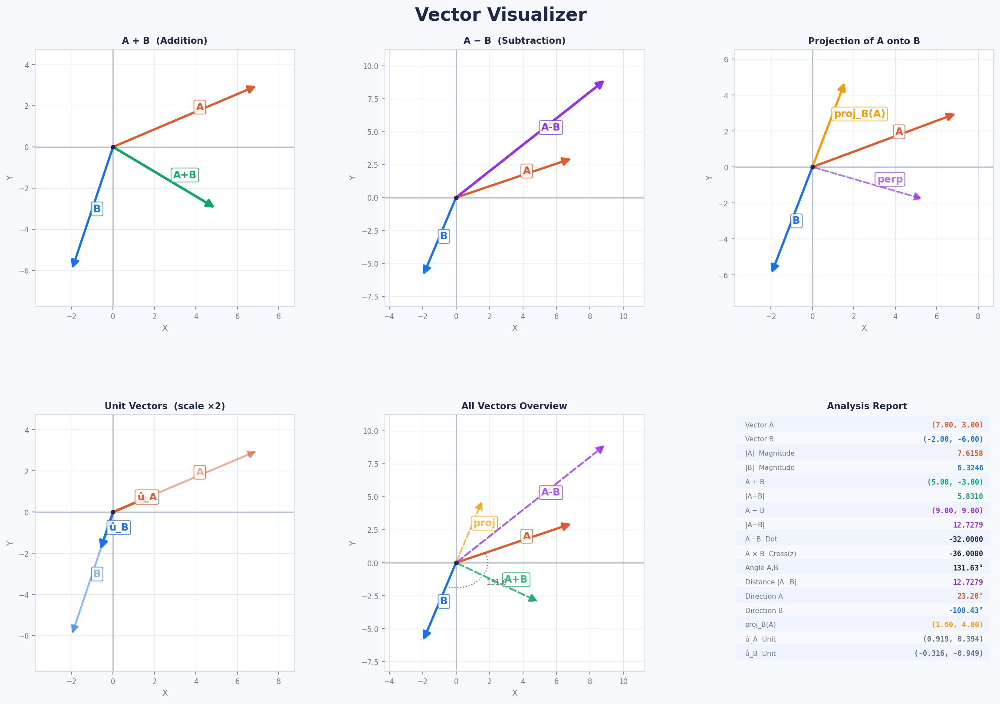

# 📐 Vector Visualizer 

A Python project that visualizes vectors and performs important vector operations used in Mathematics, Artificial Intelligence, and Machine Learning.

Built using:

- NumPy
- Matplotlib

---

## 🚀 Project Overview

This project allows users to enter two vectors and then:

- Calculate vector magnitudes
- Perform vector addition
- Perform vector subtraction
- Calculate dot product
- Calculate cross product
- Find angle between vectors
- Calculate distance between vectors
- Find vector directions
- Generate unit vectors
- Calculate vector projection
- Visualize vectors on a graph

---

## 📊 Features

### Vector Analysis

✅ Magnitude Calculation

✅ Vector Addition

✅ Vector Subtraction

✅ Dot Product

✅ Cross Product

✅ Angle Between Vectors

✅ Distance Between Vectors

✅ Direction of Vectors

✅ Unit Vectors

✅ Vector Projection

---

### Visualization

✅ Color-coded vectors

- 🔴 Vector A
- 🟢 Vector B
- 🔵 Resultant Vector (A + B)

✅ Cartesian Grid

✅ Axes Display

✅ Vector Labels

✅ Graph Export as PNG

---

## 🧮 Mathematical Concepts Used

### Magnitude

Calculates the length of a vector.

```math
|A| = \sqrt{x^2 + y^2}
```

### Dot Product

```math
A \cdot B
```

Used to measure similarity between vectors.

### Cross Product

```math
A \times B
```

Used to determine orientation and area relationships.

### Angle Between Vectors

```math
\theta = \cos^{-1}
\left(
\frac{A \cdot B}
{|A||B|}
\right)
```

### Unit Vector

```math
\hat{A} = \frac{A}{|A|}
```

### Projection

Projection of vector A onto vector B.

---

## 🤖 AI & Machine Learning Connection

Vectors are the foundation of modern AI systems.

Applications include:

- Machine Learning Features
- Word Embeddings
- Recommendation Systems
- Computer Vision
- Neural Networks
- Large Language Models (LLMs)

This project helps build intuition for the mathematics behind AI.

---

## 🛠 Technologies Used

| Library | Purpose |
|----------|----------|
| NumPy | Vector calculations |
| Matplotlib | Graph visualization |
| Python | Core programming |

---

## 📂 Project Structure

```text
VectorVisualizer/
│
├── VectorVisualizer.py
├── vector_visualizer_output.png
├── README.md
```

---

## ▶️ How to Run

### 1. Clone Repository

```bash
git clone https://github.com/Manahilch18/VectorVisualizer.git
```

### 2. Install Dependencies

```bash
pip install numpy matplotlib
```

### 3. Run Program

```bash
python VectorVisualizer.py
```

---

## 💻 Example Input

```text
Vector A:
x = 4
y = 3

Vector B:
x = 6
y = -3
```

---

## 📈 Example Output

```text
Magnitude A: 5.0000
Magnitude B: 6.7082

A + B = (10, 0)
A - B = (-2, 6)

Dot Product = 15
Cross Product = -30

Angle = 63.43°

Distance = 6.3246

Direction A = 36.87°
Direction B = -26.57°
```

---

## 🎯 Learning Outcomes

Through this project I learned:

- Vector mathematics
- NumPy array operations
- Mathematical visualization
- Matplotlib plotting
- Coordinate systems
- Real-world AI mathematics
- Python project organization

---

## 📸 Sample Visualization

 
```text
 
```

---

## 🔮 Future Improvements

- 3D Vector Visualization
- Multiple Vector Support
- GUI using Tkinter
- Dark Mode
- Interactive Graph Controls
- Vector Animation

---

## 👩‍💻 Author

Manahil

Learning Journey:
Python → NumPy → Pandas → Matplotlib → Mathematics for AI/ML → Machine Learning

---

⭐ If you found this project useful, consider giving it a star.